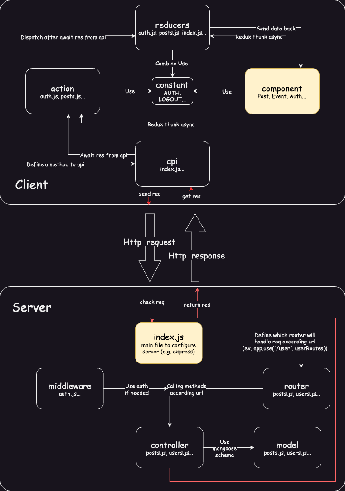

## PetMate

## Introduction

Using React, Node.js, Express & MongoDB to build a Full Stack MERN Application. The App is called "PetMate" and it is a pet owner community app that allows users to meet like friends and have some group activities with same interest friends offline.

## Init

Setup:
- First of all, in order to connect to the database, You need to login in on `https://www.mongodb.com/atlas`  to add your current IP address to in `Network Access`.  The account number is `haidong.xu@tum.de`, The password is `hfv7d7jhUPNqpW.`
- CONNECTION_URL is the link to the cloud database that you have set up on mongodb. 
- Sender, PASS and HOST are needed for mail-message function in our application
- You can find already setup .env file with valid CONNECTION_URL, Sender, PASS and HOST in the server folder
- After setup of the above, run ``npm install -force`` and ``npm start`` for client folder, and ``npm install`` and ``npm start`` for server folder to start the app

test account:
-Non-membership user account: `haidong.xu@tum.de`, password `Haidongxu1234--`
-Membership user account: `zidong.wang@tum.de`   password: `5691569aDONG!`

## Technical documentation
Here we will instruct our code in each folder.

## Client
### Client/src/actions
The actions folder contains functions that send data (payload) to reducers to update the application state. These functions are typically triggered by events such as button clicks or form submissions.

### Client/src/components
The components folder contains our reusable React components, which can be imported and used in other parts of the application.

### Client/src/api
The api folder contains functions for making API calls to a server, typically using a library like Axios or Fetch.

### Client/src/constants
The constants folder contains constants or configuration values that are used throughout the application, such as API endpoints or action types.

### Client/src/images
The images folder contains image files used in the application.

### Client/src/reducers
The reducers folder contains functions that handle state updates based on actions triggered by the user. The state updates are returned as a new state object, which is then stored in the application's global state.

### Client/src/App.js
This is the main component that renders other components and is responsible for routing and managing state.

### Client/src/index.js
This is the entry point of the React application and is responsible for rendering the App component and initializing the Redux store and other configuration settings.

## Server
### Server/controllers/
The controller folder contains the logic for handling incoming HTTP requests, processing data, and returning responses.

### Server/middleware/
The middleware folder contains functions that can be applied to incoming requests to modify them or add additional behavior before they are handled by the controller. Like the same action but from diff user.

### Server/models/
The models folder contains the database schema definitions and data access functions for interacting with the database.

### Server/routes/
The routes folder contains the definitions for the routes that the application will handle, mapping HTTP methods and URLs to controller functions.

### Server/index.js
The index.js file ties everything together, importing the necessary modules and setting up the server to listen for incoming requests.

## Illustrations
The following diagram depicts the architecture of this project and how the files collaborate with each other.
